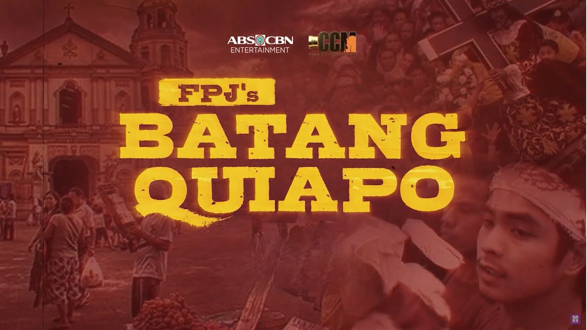

# app-dev
# My first repository.

# My Favorite Series - FPJ's Batang Quiapo

## My Favorite Character is Coco Martin a.k.a Tanggol

**FPJ's Batang Quiapo is a Philippine action-comedy drama television series broadcast by Kapamilya Channel.**

**Plot: A young man named Tanggol (Coco Martin) rises to be one of the biggest outlaws in the neighborhood while he navigates his way in life to survive in Quiapo. Hoping to earn the affection of his parents, his fate draws him closer to the truth about his identity**

[Batang Quiapo Wiki](https://en.wikipedia.org/wiki/Batang_Quiapo_(TV_series))

**Main Cast:** 
1. Coco Martin as Hesus Nazareno "Tanggol" A. Dimaguiba
2. Lovi Poe as Monica "Mokang" Dimaculangan
3. Christopher de Leon as Ramon Montenegro
4. Lito Lapid as Supremo "Primo" C. Medina
5. John Estrada as Patrolman Rigor Dimaguiba
6. Charo Santos as Matilde "Tindeng" Asuncion
7. Cherry Pie Picache as Ma. Teresa "Marites" Asuncion-Dimaguiba
8. Lorna Tolentino as Amanda Salonga
9. Jaclyn Jose as Jail Chief Brigadier General Dolores Espinas
